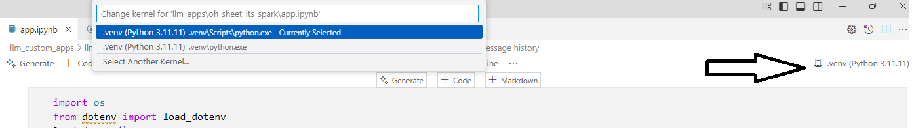
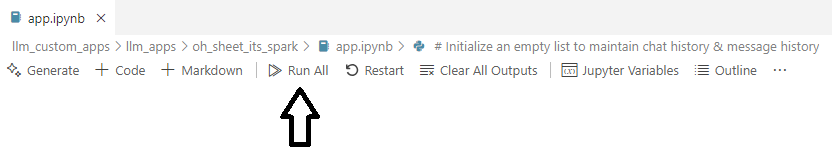
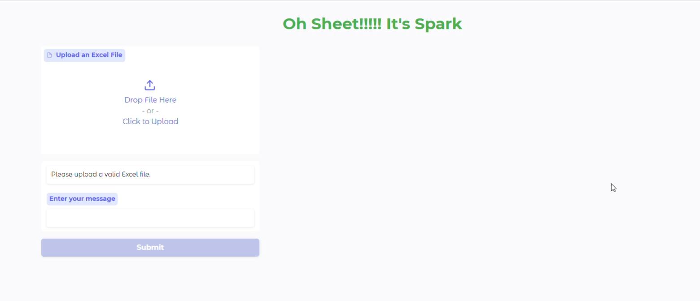

# Setup

## 1. Set Environment Variable

Ensure pipenv installs packages in the virtual environment of the current project. This forces the virtual environment to be created inside the project directory (in `.venv`).

```sh
export PIPENV_VENV_IN_PROJECT=1
```

## 2. Set the environment file .env variable with following keys

Modify the value for HF_TOKEN to reflect your Hugging Face token and replace value for PROJECT_PATH to reflect where you have cloned this project

```sh
HF_TOKEN=hf_XXXX
PROJECT_PATH=D:\gitprojects
```

## 3. Create Conda Environment

Create a Conda environment with Python 3.11.11

```sh
conda create --prefix ./.venv python=3.11.11
```

## 4. Install Packages

Install the required packages using pipenv.

```sh
pipenv install
```

# Running the Apps

## OhSheet!!!ItsSpark

### 1. Navigate to below Jupyter Notebook
```
llm_apps\oh_sheet_its_spark\app.ipynb
```
### 2. Select Jupyter Kernel that resides inside the script directory of virtual environment



### 3. Click Run All



### 4. Gradio App Opens in the browser

Gradio app will then open in the browser . Use upload button to select spreadsheet you want to convert to pyspark & the app immediately generates the pyspark equivalent code.If you want some more ad-hoc changes , use the message textarea to describe your specific changes



### 5. Changing the Model Used

#### Switching Models to use a different free Inference Client thats Warm

Simply change value of the variable inf_mdl_nm currently to "Qwen/Qwen2.5-Coder-32B-Instruct"

```python
inf_mdl_nm = "Qwen/Qwen2.5-Coder-32B-Instruct"
```

#### Switching To your own private model

If you want to switch to your own privately deployed or locally quantised model simply replace the below 2 method invocations with your own method which invokes the LLM passing the message variables **initial_msg** and **msg_history** to the 2 different calls

```python
cd_resp = generate_responses_from_inf(hf_token, initial_msg, inf_mdl_nm, 5000)
```

```python
bot_response = generate_responses_from_inf(hf_token, msg_history, inf_mdl_nm, 5000)
```

### 6. Using Test File for Upload

You can use the below file path in the project to test uploads:
```
datasets\test_datasets\SalesData1.xlsx
```